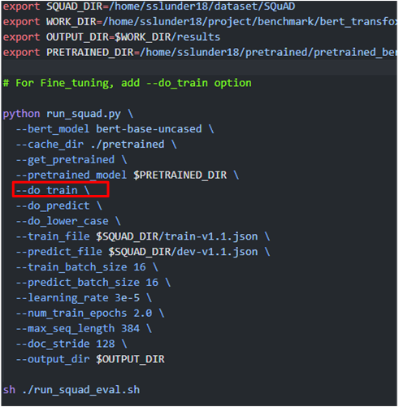

# BERT, TransfoXL (Transformer Model)

## Project details

BERT-base 110M, BERT-large 345M, Transformer-XL 257M 등 transformer 기반 모델들을 Evaluation 하는 프로젝트. 

특정 데이터셋에 (Wikitext103, SQuAD) 대해서는 정확도(accuracy)를 측정하여 얻을 수 있고, 일반적인 모델의 성능은 Perplexity을 측정하여 얻는다다.

참고 github 주소: https://github.com/LuoweiZhou/pytorch-pretrained-BERT/tree/master?tab=readme-ov-file

## Environment 준비

environment

- python 3.10.14
- torch 2.4.0 + cu12.1
- tqdm 4.66.4
- numpy 1.26.4
- pandas
- pillow

이외의 자세한 패키지 환경은 아래 yaml 파일을 참고

가상환경: gpt (이름은 gpt여도 bert도 돌릴 수 있음)

[gpt.yaml](./gpt.yaml)

프로젝트 메인인 디렉토리 : dnn_benchmark/bert_transfoxl

## dataset 다운로드 방법

- [train-v1.1.json](https://rajpurkar.github.io/SQuAD-explorer/dataset/train-v1.1.json)
- [dev-v1.1.json](https://rajpurkar.github.io/SQuAD-explorer/dataset/dev-v1.1.json)
- [evaluate-v1.1.py](https://github.com/allenai/bi-att-flow/blob/master/squad/evaluate-v1.1.py)
- 위 사이트를 들어가 파일을 다운로드, 혹은 내용을 직접 복사붙여넣기 하여 파일을 생성한다.
- 다운로드(생성)한 파일은 `$SQUAD_DIR`에 저장하여 dataset으로 활용한다.

## pretrained model 다운로드 받는법

### hugging face에서 직접 받는 방법

주소 : https://huggingface.co/google-bert/bert-base-uncased/tree/main

)

- 이후 위처럼 pretrained model을 저장하는 디렉토리 하에 config.json과 pytorch_model.bin, 그리고 vocab.txt 파일을 위치시킨 후, 이 경로를 입력해주면 된다.

### **코드를 이용하는 방법**

- run_squad.py 파일의 옵션으로 bert_model 에 원하는 pretrained model의 이름을 입력한다. 해당 pretrained model의 이름 리스트는 https://huggingface.co/transformers/v3.3.1/pretrained_models.html 이 사이트에 나와있다.
- 해당 방법으로 pretrained model을 다운로드 할 경우, 파일의 이름이 이상할텐데, 이를 log혹은 log json을 보고 맞추어 수정해주면 된다.

콘솔 로그를 보거나

같이 생성된 log json 파일을 본다.

vocab.txt 로 파일의 이름을 바꿔준다.

- 이후 pretrained 디렉토리를 pretrained_model 디렉토리로 설정하여 사용한다.

## Training 방법

- pretrained model을 이용하여 SQuAD v1.1 데이터셋에 finetuning 할 수도 있다.
- 프로젝트의 메인 디렉토리인 bert_transfoxl 에 있는 run_squad.sh 스크립트를 사용한다.

- `--do_train` : fine tuning training 을 진행할 수 있다.
- `--do_predict` : prediction을 진행한다.
- `--train_file` : train dataset json 파일 위치
- `--predict_file` : validation dataset json 파일 위치
- `--output_dir` : output result directory, 이 위치에 사용했던 모델의 config.json 파일과 prediction 결과 json 파일, 그리고 finetuning 된 binary 파일, 그리고 사용된 vocab.txt 파일이 저장된다.

## Evaluation 방법

- training 과 마찬가지로, 동일한 run_squad.sh 스크립트를 사용한다.
- do_predict 옵션을 통해 model을 통한 prediction 결과 json 파일을 출력할 수 있다.

- predict가 끝나고, predict한 json 파일을 출력한 이후 아래 있는 sh ./run_squad_eval.sh 명령을 통해 자동으로 prediction json 파일과 dev-v1.1.json 파일을 비교하여 exact match와 f1 score 를 얻을 수 있다. 이때 아래의 run_squad_eval.sh 스크립트 파일에 ground truth 파일의 위치와, prediction한 파일의 위치를 설정해주기만 하면 된다. prediction_file의 위치는 `--output_dir`  위치의 prediction.json 파일로 설정해주면 된다.

- evaluation을 진행하면 아래와 같이 exact_match 와 f1 score를 얻을 수 있다.

bert evaluation 결과

- 나머지 argument 옵션들은 python 파일과 원래 github 주소의 설명을 참고한다.
