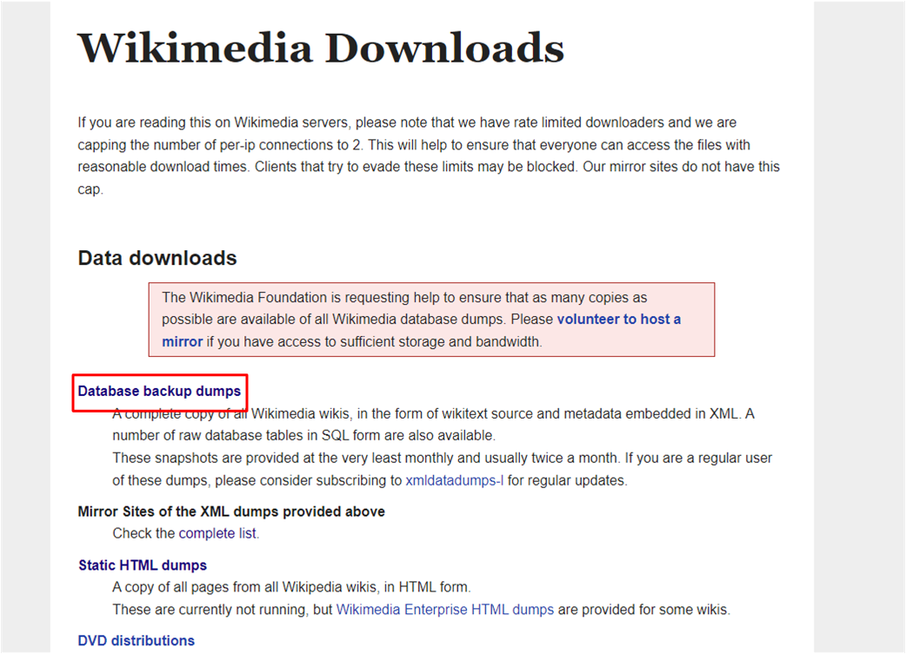
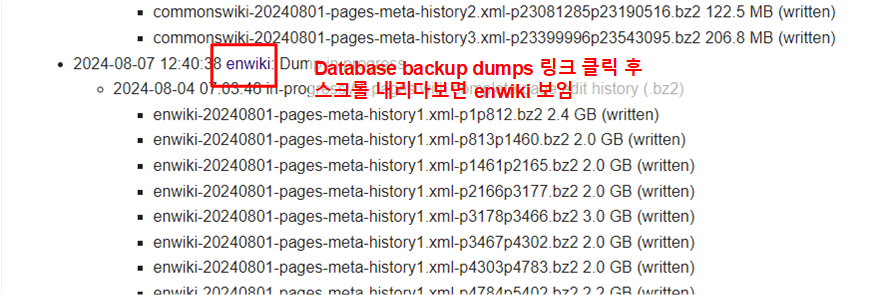
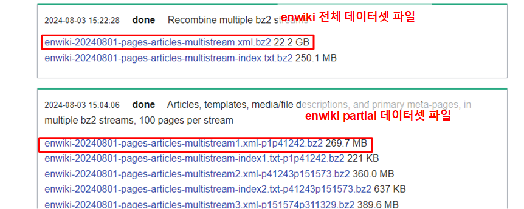
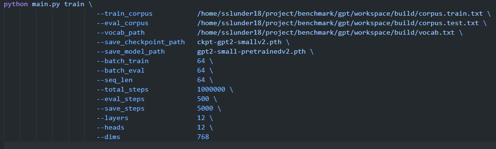
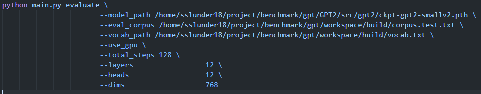
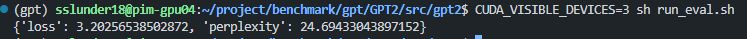
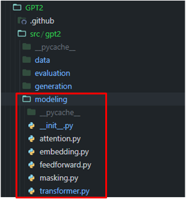
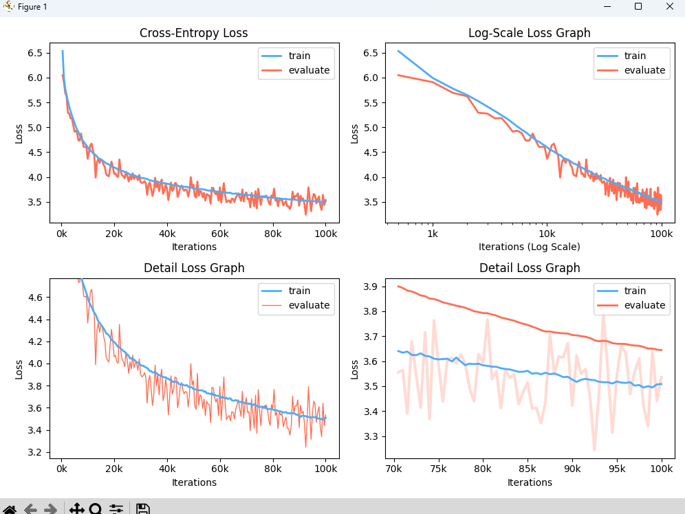
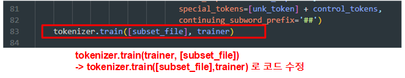

# GPT-2

## Project details

GPT-2 small, large 모델 등을 training 하고, evaluation 할 수 있는 프로젝트.

참고 github 주소 : https://github.com/affjljoo3581/GPT2

## Environment 준비

environment

- python 3.10
- regex
- tqdm
- torch
- numpy < 2.0.0
- matplotlib
- nltk
- ijson
- tqdm>=4.46.0
- mwparserfromhell>=0.5.4
- tokenizers>=0.7.0
- kss==1.3.1
- 모든 자세한 패키지 내용은 아래 yaml 파일을 참고한다.

가상환경: gpt

[gpt.yaml](./gpt.yaml)

프로젝트 메인 디렉토리 : dnn_benchmark/gpt2

## Dataset 준비

- expanda 패키지를 사용해서 corpus dataset을 만들어 사용한다.
https://github.com/affjljoo3581/Expanda ← expanda package
- pip install을 통해 expanda 패키지를 설치한다.

```bash
$ pip install expanda
```

- workspace (데이터셋을 저장할 디렉토리)를 생성한다.

```bash
$ mkdir workspace
$ cd workspace
```

- Wikipedia dump file을 [여기서](https://dumps.wikimedia.org/) 다운로드 받는다. 혹은 아래 코드를 입력하여 서버에서 바로 다운을 받는다. 로컬에서 파일 다운로드 후, 서버에 올리는 것을 추천한다. enwiki dataset을 이용하는 것으로 가정한다. 특정 partial 데이터를 다운받을 수 있고, 전체 enwiki dataset을 다운받을 수도 있다. 혹은 enwiki dataset이 아닌 다른 wikitext dataset을 다운받을 수도 있다.







- 아래는 콘솔 명령을 통해 데이터를 다운받는 방법이다.

```bash
$ mkdir src
$ wget -O src/wiki.xml.bz2 https://dumps.wikimedia.org/enwiki/20240801/enwiki-20240801-pages-articles-multistream1.xml-p1p41242.bz2 # 269.7MB

```

- expanda.cfg 파일을 새로 생성하여 아래 내용을 입력 후 저장해준다.

```bash
[expanda.ext.wikipedia]
num-cores           = 6

[tokenization]
unk-token           = <unk>
control-tokens      = <s>
                      </s>
                      <pad>

[build]
input-files         =
    --expanda.ext.wikipedia     src/wiki.xml.bz2 # wiki.xml.bz2 저장 위치
```

- 아래와 같은 디렉토리 구조를 유지한다.

```
workspace
├── src
│   └── wiki.xml.bz2
└── expanda.cfg
```

- expanda.cfg 가 있는 workspace 디렉토리에서 `$ expanda build`  명령을 실행해준다. build 작업은 꽤 오래걸리는 점을 유의한다.
- build 가 완료되면 아래와 같은 디렉토리 구조로 완성된다.

```
workspace
├── build
│   ├── corpus.raw.txt
│   ├── corpus.train.txt
│   ├── corpus.test.txt
│   └── vocab.txt
├── src
│   └── wiki.xml.bz2
└── expanda.cfg
```

- 이제 위에 build 디렉토리 안의 corpus.train.txt, corpus.text.txt, vocab.txt 등을 사용할 수 있다.

## pretrained model 준비

- 해당 프로젝트는 pretrained 된 모델을 제공하지 않는다. 따라서 적절히 training을 진행하여 pretrained model을 생성해야한다.

## Training 하는 방법

- src/gpt2 디렉토리의 run_train.sh 스크립트를 이용한다.



- train_corpus : expanda를 이용해서 build한 corpus.train.txt 경로
- eval_corpus: expanda를 이용해서 build한 corpus.test.txt 경로
- vocab_path : expanda를 이용해서 build한 vocab.txt 경로
- 만약 gpt2 small 모델을 training 할 것이라면, layers, heads, dims 옵션을 위와같이 설정하고, medium이나 다른 모델을 training 할 것이라면 layers와 heads, dims를 모델 구조에 맞추어 설정한다.
- argument 내용은 src/gpt2 디렉토리의 main.py 및 train_model.py 파일을 참고한다.

## Evaluation 하는 방법

- src/gpt2 디렉토리의 run_eval.sh 스크립트를 이용한다.



- model_path : pretrained model 경로
- eval_corpus : expanda로 build 한 corpus.text.txt 경로
- use_gpu : cuda gpu 사용
- total_steps : evaluation step을 몇번 진행할지. default 값은 최대값으로 적용된다.
- layers, heads, dims : 모델을 training 했을 때 사용했던 옵션 그대로 적어준다.

### test 결과



evaluation 결과

## 모델 수정 방법



- src/gpt2/modeling 디렉토리 하에 있는 파일들을 수정하여 모델을 수정한다.

**Training visualization**



**Expanda 사용 도중 에러**

site-package의 expanda 패키지를 찾고, tokenizer.py 파일의 83번 line 을 수정한다.


