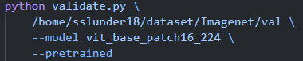
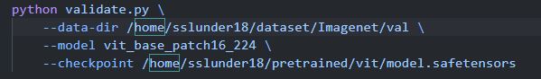
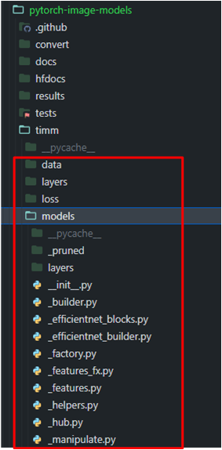

# Pytorch_image_classification

## Project details

Pytorch 를 백엔드로 하여, 여러 image classification 모델(Resnet, Mobilenet, EfficientNet, Vit, Convnext 등)들을 evaluation 할 수 있는 프로젝트.


허깅페이스 timm 사용 github: https://github.com/huggingface/pytorch-image-models

ImageNet dataset 참고:  https://on-ai.tistory.com/8

## Environment 준비

environment

- python 3.10.14
- torch 1.12.1 + cu11.6
- tensorboard, tensorboardX
- huggingface_hub
- safetensors
- numpy 1.25.2 < 2.0

가상환경: resnet

[resnet.yaml](../env/resnet.yaml)

프로젝트 메인 디렉토리 : dnn_benchmark/pytorch_image_classification

## Dataset 준비

- image classification task 에서는 일반적으로 많이 사용하는 imagenet 1k 데이터셋을 이용한다. 따라서 일반적인 방법(imagenet 공식 홈페이지 이용 or 다른 방법으로 imagenet 다운)으로 imagenet 1k 데이터셋을 다운로드한다.
- 다운로드 받은 tar 압축 파일을 리눅스 서버 위 적절한 곳에 위치시키고, 해당 압축 파일이 있는 디렉토리에서 아래의 command를 입력하여 자동으로 압축을 해제하고 디렉토리를 정리한다. 만약 validation data 만 이용할 것이라면 validation data에 대해서만 extract를 진행한다.

참고: https://on-ai.tistory.com/8

```
# extract train data
mkdir train && mv ILSVRC2012_img_train.tar train/ && cd train
tar -xvf ILSVRC2012_img_train.tar && rm -f ILSVRC2012_img_train.tar
find . -name "*.tar" | while read NAME ; do mkdir -p "${NAME%.tar}"; tar -xvf "${NAME}" -C "${NAME%.tar}"; rm -f "${NAME}"; done

# extract validation data
cd ../ && mkdir val && mv ILSVRC2012_img_val.tar val/ && cd val && tar -xvf ILSVRC2012_img_val.tar
wget -qO- https://raw.githubusercontent.com/soumith/imagenetloader.torch/master/valprep.sh | bash
```

```
Imagenet1k
├── train
│   ├── n01440764
│   └── ...
└── val
    ├── n01440764
    └── ...
```

## pretrained model 준비

### hugging face 에서 직접 다운로드

pretrained model 주소: https://huggingface.co/timm/vit_base_patch16_224.augreg2_in21k_ft_in1k/tree/main

- 위의 주소에서 model.safetensors 를 다운 받는다.
- 만약 다른 모델을 사용하는 경우에는 hugging face에 timm-<model_name> 을 검색하여 제공하는 pretrained model (model.safetensors)을 다운로드한다.
- 다운 받은 모델을 서버의 적절한 위치에 저장한다.
- model.safetensor 는 hugging face에서 주도적으로 개발하고 있는 ai 모델의 데이터를 저장하고 배포하기 위한 새로운 형식으로, ckpt 파일보다 많은 장점을 가지고 있다.
    - 모델의 구조와 코드를 json 헤더에 저장하므로, 별도의 파이썬 파일이 필요하지 않다.
    - 형식은 리틀 엔디언 방식을 사용하여 다른 언어나 프레임워크와 호환될 수 있다.
    - 형식은 하나의 파일로 구성되므로 관리하기 쉽고 용량이 작다.

### 코드를 실행하여 자동으로 다운로드

사용 가능한 timm pretrained model list : https://sjkoding.tistory.com/19



- timm pretrained model list 에서 사용할 model의 이름을 찾은 후, model 옵션에 적어주고, pretrained 옵션을 주면 자동으로 pretrained model을 다운로드 받을 수 있다.
- 다운로드 된 pretrained model의 cache 파일 위치는 본인 home 폴더의 `$home/.cache/huggingface/hub`  디렉토리 아래에 저장되어있다.

## Training 하는 방법

참고: https://huggingface.co/docs/timm/training_script

```
python train.py --data-dir /path/to/imagenet --model <model name> --sched cosine --epochs 150 --warmup-epochs 5 --lr 0.4 --reprob 0.5 --remode pixel --batch-size 256 --amp -j 4
```

- 자세한 argument 내용은 train.py 파일을 참고한다.
- 만약 pretrained model을 이용해서 fine tuning을 하는 경우라면 `--pretrained-path <path/to/pretrained_model>`  옵션으로 다운로드한 model.safetensor 의 경로를 입력해준다. /model.saftensor 까지 입력해주면 된다.

## Evaluation 하는 방법

참고: https://huggingface.co/docs/timm/training_script#validation--inference-scripts



- `--data-dir`  : imagenet validation dataset 경로
- `--model` : 사용하는 모델 이름 (resnet50, mobilenetv2_100, vit_base_patch16_224, deit3_large_patch16_224, efficientnet_b0~b8, convnext_base 등)
- `--checkpoint` : pretrained model 경로
- 만약 pretrained model을 코드를 통해 다운로드 받고 싶다면 `--pretrained`  옵션을 주면 된다.

## 모델 수정 방법

- 프로젝트 메인 디렉토리의 timm/models/vision_transformer.py 와 같이 model 디렉토리의 코드를 수정하거나, 이와 관련된 파일들을 수정한다.


