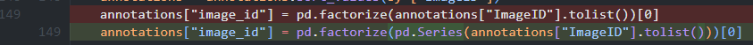
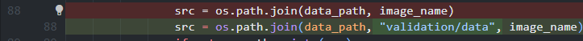
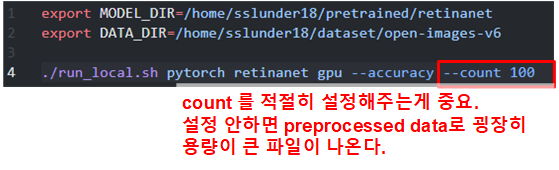
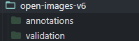
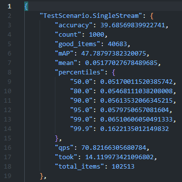
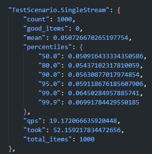

# Retinanet

## Project details

MLPerf inference benchmark 를 이용하여 Object detection task 에서 Retinanet 모델을 test 하는 프로젝트.

참고 github 주소: https://github.com/mlcommons/inference/tree/master/vision/classification_and_detection

## Environment 준비

- python 3.10
- torch 1.12.1 + cu 11.6
- pybind11
- 이외의 자세한 패키지 환경은 아래 yaml 파일을 참고한다.

가상환경 retinanet

[retinanet.yaml](./vision/classification_and_detection/retinanet.yaml)

프로젝트 메인 디렉토리 : dnn_benchmark/retinanet


## Dataset 준비

- 데이터셋으로 open-images-v6 (mlperf ver.) 을 이용한다.
- 스크립트를 사용하기 전에 inference/vision/classification_and_detection/tools 디렉토리의 openimages.py의 149번 line을 아래와 같이 수정한다.
pd.factorized(annotatoins[”ImageID”].tolist())[0]
→ pd.factorize(pd.Series(annotations[”ImageID”].tolist()))[0]



- inference/vision/classification_and_detection/tools 디렉토리의 openimages_mlperf.sh 스크립트를 이용하여 데이터셋을 다운로드 할 수 있다.

```bash
./openimages_mlperf -d <DOWNLOAD_PATH>
```

## Pretrained model 준비

- [from zenodo](https://zenodo.org/record/6617981/files/resnext50_32x4d_fpn.pth) 이 링크를 통해 다운받고, 서버의 적당한 위치에 저장한다.

## Training 방법

- 해당 프로젝트는 mlperf의 inference test를 위한 project이기 때문에 이 프로젝트에서 training을 하는 방법은 없다. 따로 mlperf github에서 제공하는 training test 방법을 이용하면 된다.

## Evaluation 방법

- 먼저 inference/vision/classification_and_detection/python 디렉토리의 openimages.py 파일의 88번 line을 아래와 같이 수정한다. validation/data 디렉토리 하에 들어있는 image 파일들을 불러오기 위해 경로를 살짝 수정하였다.



- 그 다음 inference/vision/classification_and_detection/run_eval.sh 스크립트를 이용하여 evaluation을 진행한다.



```bash
./run_local.sh <backend> <model> <device> [--optional...]
```

- MODEL_DIR : pretrained model 경로, pth 파일 까지는 안적어도됨
- DATA_DIR : open-images-v6 데이터셋 경로. 해당 디렉토리의 구조는 아래와 같이 이루어져있음



- `--count` : accuracy test에 사용할 이미지 샘플의 개수. 만약 이 옵션을 주지 않으면 모든 validation set에 대해 accuracy 측정을 실시하는데, 이 과정 중에 preprocessed 된 numpy 데이터를 출력하는데 이 파일의 크기가 굉장히 크기 때문에 웬만하면 낮은 count 수를 설정해서 evaluation 하는 것이 좋다.
- `--accuracy` : accuracy test 실행하기 위한 옵션. 이 옵션을 주지 않으면 Performance test 만 수행한다.
- 이외의 자세한 argument 내용은 inference/vision/classification_and_detectoin/python 디렉토리의 main.py 파일 및 기존 github 주소의 readme 파일을 참고한다.

# mlperf test 결과



1000개 샘플에 대해 accuracy  test결과



performance test 결과

- MLPerf의 경우 정확한 benchmark 가 가능하지만, model 의 수정이 어려운 부분이 있다.
