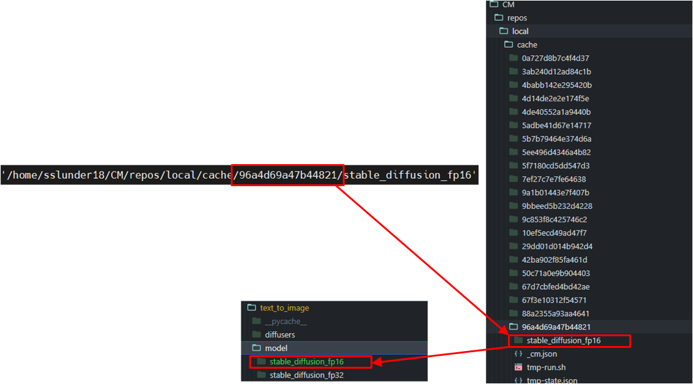
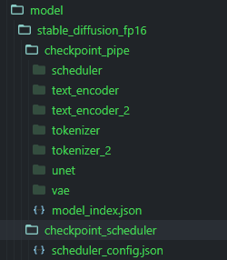
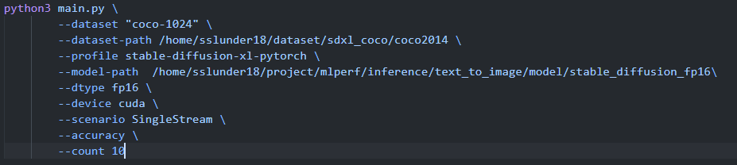
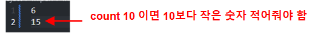
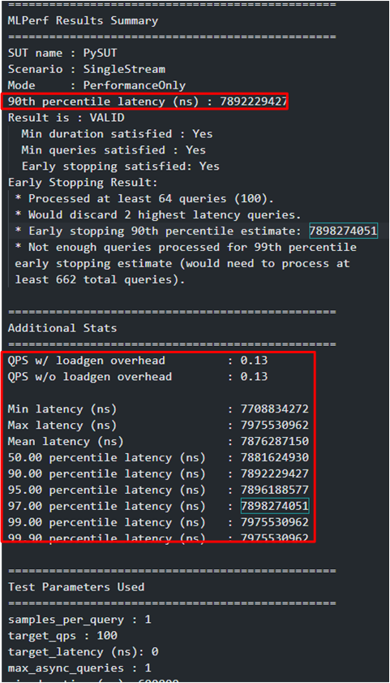
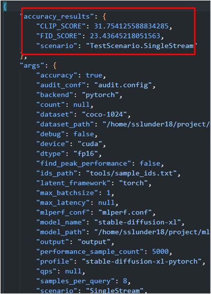
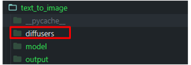
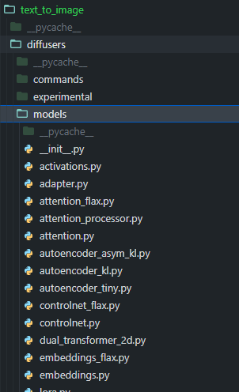

# Stable-Diffusion-XL 1.0 (SDXL 1.0)

참고 github 주소:
https://github.com/mlcommons/inference/tree/master/text_to_image

## Project details

Text to image task 를 수행하는 [Stable-Diffusion-XL 1.0](https://huggingface.co/docs/diffusers/ko/api/pipelines/stable_diffusion/stable_diffusion_xl) 을 MLPerf 벤치마크 프레임워크로 수행하는 프로젝트

COCO-2014 데이터셋에 대해서 Image generation 을 수행한 후, CLIP score 및 FID Score를 측정하여 얻을 수 있다.


## Environment 준비

environment

- python 3.10
- pybind11
- torch 2.4.0 + cuda 12.1
- opencv-python
- pillow
- scipy
- transformers
- pycocotools
- safetensors
- tensorboard
- 등 모든 자세한 패키지 내용은 아래 yaml 파일을 참고한다.

가상환경: sdxl

[sdxl.yaml](./text_to_image/sdxl.yaml)

프로젝트 메인 디렉토리 : dnn_benchmark/sdxl/inference/text_to_image


## Dataset 준비

- coco 2014 데이터셋을 사용한다.
- inference/text_to_image/tools 디렉토리의 download-coco-2014.sh 스크립트를 이용한다.

```bash
# Set the following helper variables
export ROOT=$PWD/inference # $PWD는 현재 프로젝트 메인인 디렉토리
export SD_FOLDER=$PWD/inference/text_to_image
export LOADGEN_FOLDER=$PWD/inference/loadgen
export MODEL_PATH=$PWD/inference/text_to_image/model/

cd $SD_FOLDER/tools
./download-coco-2014.sh -n <number_of_workers>
```

- 다운로드 완료시 coco2014 디렉토리가 생성되는데, 이 디렉토리를 원하는 위치에 옮겨 사용해도 상관없다. 다만 evaluation을 할 때에 이 경로를 잘 지정해주기만 하면된다.

## pretrained model 준비

### hugging face 에서 직접 다운로드

https://huggingface.co/stabilityai/stable-diffusion-xl-base-1.0/tree/main

- 직접 다운 받기에는 여러 파일을 다운받아야 하므로 코드를 실행하여 자동으로 다운로드 하는것을 추천한다.

### 코드를 실행하여 자동으로 다운로드

**CM method**

```bash
pip install cmind
cm pull repo mlcommons@ck
cm run script --tags=get,ml-model,sdxl,_fp16,_rclone -j
cm run script --tags=get,ml-model,sdxl,_fp32,_rclone -j
```

- cmind 패키지를 다운로드 하여 cm 을 이용한다.
- $home/CM/repos/local/cache 디렉토리의 아래에 지정된 해쉬 이름의 디렉토리에 pretrained model이 저장되고, 이 stable_diffusion_fp16 or fp32 디렉토리를 원하는 위치에 옮겨 사용하면 된다.



- 해당 모델 디렉토리의 내용은 아래와 같다. 이에 맞추어 직접 허깅페이스에서 모델을 다운로드 하여도 되지만, cm method를 이용하는 것이 간단하기 때문에 cm method를 이용하는 것을 추천한다.



## Training 하는 방법

- 해당 mlperf 프로젝트는 inference를 위한 프로젝트이기 때문에 training 진행 스크립트가 존재하지 않고, training 하기 위해서는 mlperf의 training 세션의 프로젝트를 이용해야 한다.

## Evaluation 하는 방법

- text-to-image 디렉토리의 run_sdxl_test.sh 스크립트를 이용한다. 내용은 아래와같다.



- `--dataset`  사용할 데이터셋 이름
- `--dataset-path` : 저장한 데이터셋 경로
- `--profile` : 사용할 모델 이름
- `--model-path` : 사용할 모델 경로
- `--dtype` : 사용할 floating point precision. 만약 사용할 모델이 fp16 모델이면 fp16으로 설정해줘야하고, fp32 모델이면 fp32로 설정해줘야한다.
- `--device`  : gpu 사용하기 위해선 cuda를 적어준다. cpu만 사용하려면 cpu를 적어준다.
- `--scenario` : performance test 시 사용할 시나리오를 적어준다. SingleStream, Multistream, Server, Offline. default는 SingleStream이다.
- `--accuracy` : 모델의 accuracy를 측정하기 위해선 이 옵션을 준다.
- `--count`  : accuracy test 시 사용할 샘플의 개수이다. default 값은 5000개이다. 10개의 sample을 사용한다고 하면, text-to-image/tools 디렉토리의 sample_idx.txt 의 내용을 10보다 작은 숫자로 설정하여야 sample_idx.txt 에 적힌 샘플의 stable diffusion 결과를 정상적으로 얻을 수 있다. 만약 count로 10을 사용하고 sample_idx.txt에 10 보다 큰 숫자를 적는다면 이미지 생성 결과 출력단계에서 에러가 난다.



### test 결과



performance test 결과



accuracy test 결과

## 모델 수정 방법



- 위의 그림을 보면, 기존에 pip install로 설치했던 diffuser 패키지를 workspace 로 가져와 사용한다.



- diffuser 디렉토리의 model 디렉토리 안의 여러 모듈들을 수정하여 모델을 수정하여 test 할 수 있다.
