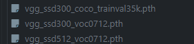
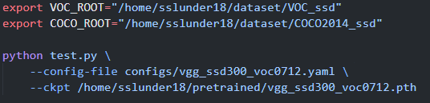
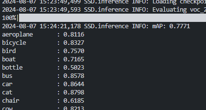
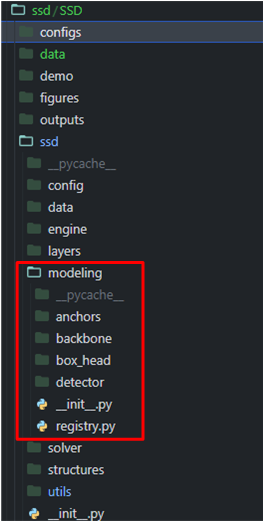

# SSD (Single Shot Detector)

## Project details

Object detection task에서 사용되는 [SSD(Single Shot Detector)](https://arxiv.org/abs/1512.02325) 모델을 evaluation 하는 프로젝트.

COCO-2014, VOC2007, VOC2012 데이터셋에 대해 mAP를 측정하여 얻을 수 있다.

참고 깃허브: https://github.com/lufficc/SSD

## Environment 준비

environment

- python 3.10.14

가상환경 : ssd

[ssd.yaml](./ssd.yaml)

프로젝트 메인 디렉토리 : dnn_benchmark/ssd

## Dataset 준비

- SSD/data 디렉토리의 COCO2014.sh 스크립트와 VOC2007.sh , VOC2012.sh 스크립트를 사용하여 데이터셋을 다운로드 한다.
- 아래와 같은 디렉토리 구조로 구성한다.

```
VOC_ROOT
|__ VOC2007
    |_ JPEGImages
    |_ Annotations
    |_ ImageSets
    |_ SegmentationClass
|__ VOC2012
    |_ JPEGImages
    |_ Annotations
    |_ ImageSets
    |_ SegmentationClass
|__ ...
```

```
COCO_ROOT
|__ annotations
    |_ instances_valminusminival2014.json
    |_ instances_minival2014.json
    |_ instances_train2014.json
    |_ instances_val2014.json
    |_ ...
|__ train2014
    |_ <im-1-name>.jpg
    |_ ...
    |_ <im-N-name>.jpg
|__ val2014
    |_ <im-1-name>.jpg
    |_ ...
    |_ <im-N-name>.jpg
|__ ...
```

## Pretrained model 준비

- 아래의 모델 중 원하는 모델을 다운로드 링크를 통해 다운로드 후, 적당한 위치에 저장한다.

**Origin Paper:**

|  | VOC2007 test | coco test-dev2015 |
| --- | --- | --- |
| SSD300* | 77.2 | 25.1 |
| SSD512* | 79.8 | 28.8 |

**COCO:**

| Backbone | Input Size | box AP | Model Size | Download |
| --- | --- | --- | --- | --- |
| VGG16 | 300 | 25.2 | 262MB | https://github.com/lufficc/SSD/releases/download/1.2/vgg_ssd300_coco_trainval35k.pth |
| VGG16 | 512 | 29.0 | 275MB | https://github.com/lufficc/SSD/releases/download/1.2/vgg_ssd512_coco_trainval35k.pth |

**PASCAL VOC:**

| Backbone | Input Size | mAP | Model Size | Download |
| --- | --- | --- | --- | --- |
| VGG16 | 300 | 77.7 | 201MB | https://github.com/lufficc/SSD/releases/download/1.2/vgg_ssd300_voc0712.pth |
| VGG16 | 512 | 80.7 | 207MB | https://github.com/lufficc/SSD/releases/download/1.2/vgg_ssd512_voc0712.pth |
| Mobilenet V2 | 320 | 68.9 | 25.5MB | https://github.com/lufficc/SSD/releases/download/1.2/mobilenet_v2_ssd320_voc0712_v2.pth |
| Mobilenet V3 | 320 | 69.5 | 29.9MB | https://github.com/lufficc/SSD/releases/download/1.2/mobilenet_v3_ssd320_voc0712.pth |
| EfficientNet-B3 | 300 | 73.9 | 97.1MB | https://github.com/lufficc/SSD/releases/download/1.2/efficient_net_b3_ssd300_voc0712.pth |



## Training 방법

- 먼저 데이터셋의 경로를 환경 변수로 입력해줘야한다.

```bash
# for VOC dataset
export VOC_ROOT="/path/to/voc_root"

# for COCO dataset
export COCO_ROOT="/path/to/coco_root"
```

- SSD 디렉토리의 train.py 파일을 이용한다. SSD300을 VOC 데이터셋을 이용해 training 시키기 위해선 아래와 같이 입력한다. 데이터셋 path는 이전에 export 한 환경 변수로 자동으로 인식된다.

```bash
# for example, train SSD300:
python train.py --config-file configs/vgg_ssd300_voc0712.yaml
```

- 자세한 argument 내용은 train.py 파일을 참고한다.

## Evaluation 방법

- 메인 디렉토리의 test.py 파일 및 run_eval.sh 스크립트를 이용한다.

```bash
CUDA_VISIBLE_DEVICES=0 sh run_eval.sh
```



- `--config-file` : test할 모델의 configuration 파일 경로
- `--ckpt` : pretrained model 경로
- 자세한 argument 내용은 test.py 파일을 참고한다.



evaluation 결과

## 모델 수정 방법

- ssd/ssd 디렉토리의 modeling 디렉토리의 파일들을 수정하거나 관련된 파일들을 수정하면 된다.


