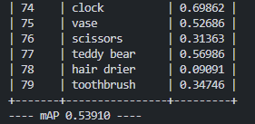
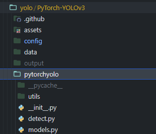

# YOLOv3

## Proejct details

Object detection task에서 활용되는 [YOLOv3](https://arxiv.org/abs/1804.02767) 모델을 사용하여 evaluation 하는 프로젝트. 

COCO-2014 데이터셋에 대해서 mAP 측정 결과를 얻을 수 있다.

참고 깃허브: https://github.com/eriklindernoren/PyTorch-YOLOv3

## Environment 준비

environment

- python 3.10.14
- torch 1.12.1 + cu113
- tensorboard 2.14.0
- numpy 1.24.4
- tqdm
- pillow
- opencv-python

가상환경 : yolo

[yolo.yaml](./yolo.yaml)

프로젝트 디렉토리 : dnn_benchmark/yolov3

## Dataset 준비

- data 디렉토리의 get_coco_dataset.sh 스크립트를 사용한다.

```bash
cd data
./get_coco_dataset.sh
```

## Pretrained model 준비

- weights 디렉토리의 download_weights.sh 스크립트를 사용한다.

```bash
cd weights
./download_weights.sh
```

## Training 방법

- 메인 디렉토리의 train.py 를 이용한다.
- Imagenet을 이용하여 pretrained된 Darknet-53 backend를 이용하여 COCO 데이터셋에 대해 학습시키기 위해서는 아래와 같이 입력한다.

```bash
python train.py --data config/coco.data  --pretrained_weights weights/darknet53.conv.74
```

- 자세한 argument 내용은 train.py 파일을 참고한다.

## Evaluation 방법

- 메인인 디렉토리의 test.py 를 이용한다.

```bash
python test.py --weights weights/yolov3.weights
```

- 자세한 argument 내용은 test.py 파일을 참고한다.



evaluation 결과

## 모델 수정 방법

- 모델의 configuration은 config 디렉토리의 yolov3.cfg 에 구성되어있다.
- pytorchyolo 디렉토리의 models.py 및 관련 파일들의 코드를 수정하면 된다.


